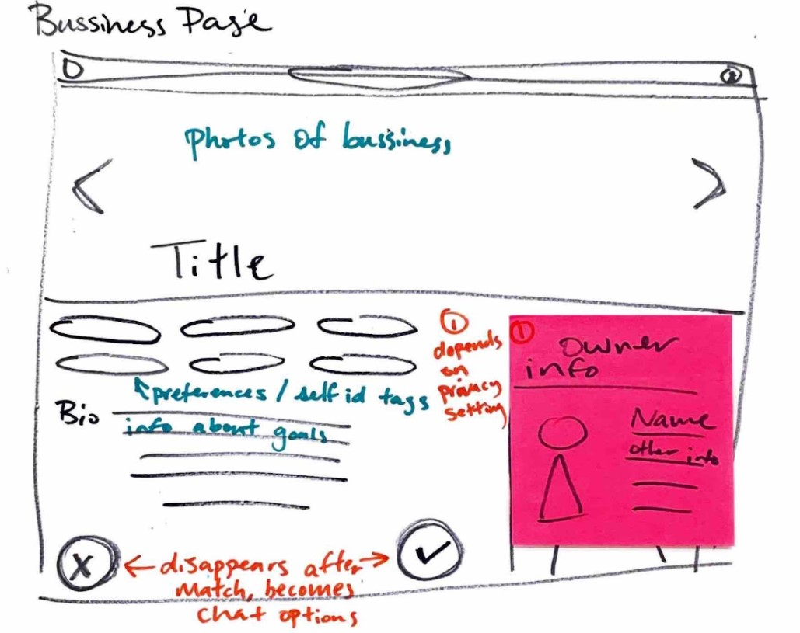
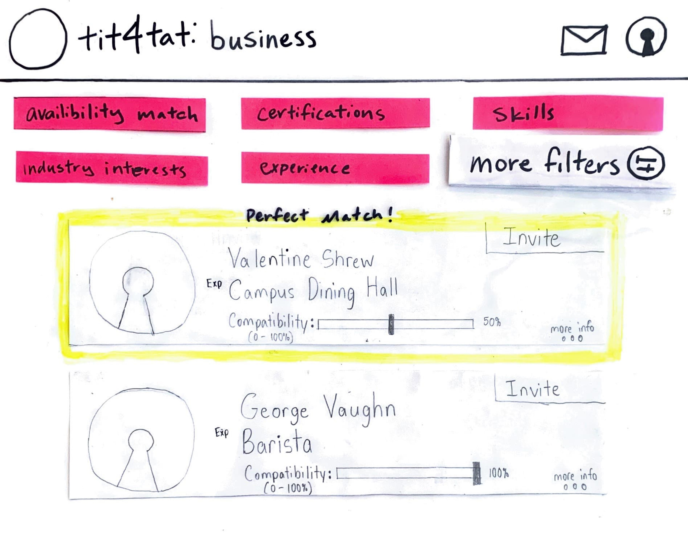
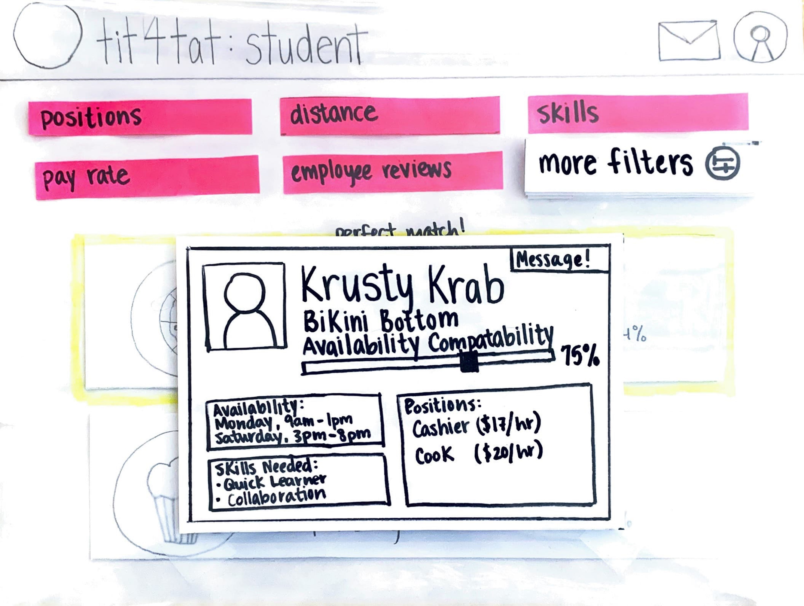
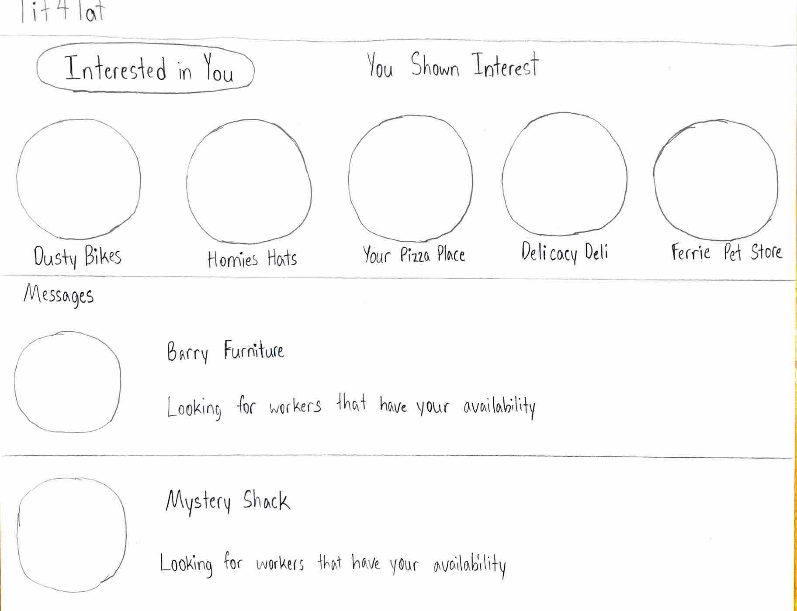
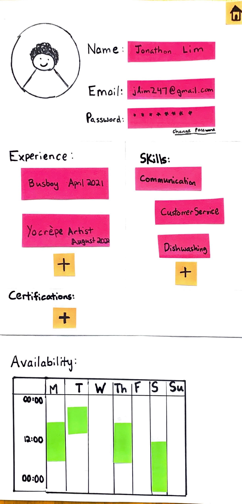

# Design Development Report
**Arla Sutton, Keanu Richards, Miles Mezaki, Katie Fleming, and Cara Mulrooney**
## **First Iteration**
Our initial design aimed to connect small businesses to other small businesses in different industries to strengthen the general community and its members. We hoped that businesses from different industries wouldn’t see each other as competition and would be more inclined to work together. One of our preliminary visions was to encourage and enable small businesses to collaborate with one another in order to foster a sense of belonging, community, and involvement, which would lead to healthier neighborhoods and communities.

Throughout this design process we explored various ways to connect small businesses, including a matching algorithm, an online marketplace, and a map sharing the locations of other businesses. Based on various pre-set criteria, businesses would be able to match and connect. These initial ideas culminated into a website platform that we brought to our first set of interviews. Initially, we were hoping to gauge interest in each of these features so that we could hone in on the best way to connect small business owners. Instead, this design failed at its conceptual level. Despite the interest that they had demonstrated during the last phase of our work, in practice, small businesses weren’t keen on collaborating with each other. Our initial product lacked the pragmatism that our user group valued. We pivoted the focus of the rest of our interviews to digging deeper into the needs of our user group and found that their difficulty hiring significantly outweighed any interest in our product. Please reference the “Second Iteration” section below for this alternative, more-refined version of our initial idea. 

## **Second Iteration**
### **Pivot**
After initiating the phase with our idea for an interface that would help small businesses, we conducted a series of interviews with potential user groups that might interact with our product. Feedback revealed that creating a network of small businesses and increasing collaborations was not the most pressing need for small businesses. While we thought this would create community, we found that small businesses are not community-oriented as much as they are success-oriented, often by necessity. More information on our initial idea development can be found above. To address a new need we identified, we pivoted our idea into an interface that helps small businesses get into contact with potential employees to work part time hours. 
Difficulty finding employees is a struggle we heard about multiple times in interviews with small business owners. Their usual pool of college age employees has been drying out with the pandemic and their usual methods of hiring have become expensive and “more like a cry for help.” Before the COVID-19 pandemic, businesses could afford to be more particular about the people that they hired. If someone offered to work for five to ten hours a week, it wouldn’t make sense to spend the energy to train them or do hiring paperwork for such low payoff. Now, small businesses are struggling intensely to find anyone to hire and will put out pleas on Facebook for anyone to work, even for less than twenty hours a week. 
We investigated the other half of our user group and found that many college students were still looking for employment, but felt like they would be unable to be hired if they could only work a couple of hours a week, as this was the precedent pre-pandemic.

### **Our Approach**
 

Our approach to addressing this issue comes in the form of a sign-in website that matches small businesses with local college students and high schoolers over the age of 18. Small businesses will share the hours they need filled with our platform and input the requirements for employees (experience, references, skills, education, etc.). We then tailor results of a search to reflect candidates who best meet the criteria given. Our filters will guarantee that the potential employee can work during one or more of the time windows specified by the business, so the person doing the hiring in the small business can then vet candidates themselves and reach out.

On the other end of things, students (potential employees) can input required personal information, like available hours, any job experience, and other potentially revealing fields like GPA. They will not have private data like home address or email shared with a company. We will have fields on our platform for candidates to input their experiences, certifications, and other achievements that they can autofill with a resume. While explicit location is not given, general location is helpful to find potential companies since location is another filter businesses can use to search. 

A key challenge we’ve identified with this platform is security–our approach at this moment is to use school emails to verify that potential employees are indeed students, and to use verification through google maps and other apps to ensure that businesses are legitimate. We’re exploring other ways to make sure that interactions between businesses and students are safe, and that unnecessary information is not shared. 

### **User Research and Findings**
Through interviews with multiple students and small businesses, we have identified a few key strengths and weaknesses of our interface. Using our rough paper prototypes, we were able to accurately convey our direction and approach and gather quality feedback. We heard from both user groups (small business owners and college students seeking employment) that the concept itself was strong and something that addressed a relevant need. The matching system was intuitive for both groups, and the search feature allowed for both groups to find relevant connections. The time availability feature was integral to the value of the platform, and we heard that we should continue to only show matches where hours and availability were compatible. We heard resoundingly that messaging should stay within the platform, rather than sharing personal contact information between parties at any point in the interaction. 
Using our paper prototypes, we also identified a variety of key points for improvements. The biggest points of discussion revolved around security and privacy, matching criteria, and ratings and recommendations. These takeaways are detailed below:

* **Security** is one of the facets of our interface that we should consider. There is potential for unwanted communication(i.e. spamming) and fraud.
* Students don’t want to suggest an **hourly rate**, but they want to be able to filter by what is being offered by businesses.
* Students and business would prefer a more social media esque interface to lean away from the more professional hiring platforms (i.e. LinkedIn, Handshake, etc.). The market already has options for more formal spaces of interaction but is lacking **effective casual channels** for these interactions. 
* Our platform should include **recurring** shifts and **occasional** (one-time) opportunity filters
* Employee **profiles** should include: possible service software experience (such as toast or squarespace), previous work experience, objective ratings from past employers, goals, and why they need the money from a short-term job
* There should be an option to **perform background checks** on students, verifying their college email or college id
* The matching system should **prioritize specific hours** that employees are available to work
* **Messaging should stay within the application**, personal information from neither party should be given out
* **Zip code** is a healthy alternative to sharing exact location or giving out addresses, but students should optionally be able to include location
* Students should optionally be able to include features like **gender, age, picture, etc**. if they think it would help build their profile
* We could stand to add “size of company” and “industry/role” as **filters**
* Students should be able to control how long they’re willing to work for [**start date, end date**, or specifying whether it’s for a semester] before their schedule changes
* We should add two different kinds of **ratings** for students to rate their employers and specify: flexibility and a healthy work culture. The possibility for hurtful personal messages in the form of a rating or recommendation can be avoided by having specific fields to fill out the interaction, such as “was this employee equipped to fill this role?” or “was this employee respectful?” and “was this employee communicative?” 

To view more images from our ideation process and our full second iteration paper prototype, check out our [photo album](https://drive.google.com/drive/folders/1-0j2wtCyLE50TkwwjoPTAUCwgwQ93Oql?usp=sharing).

To see our team effort map for this phase, please consult [Team Effort Map](EffortMapPhase2.jpg)

