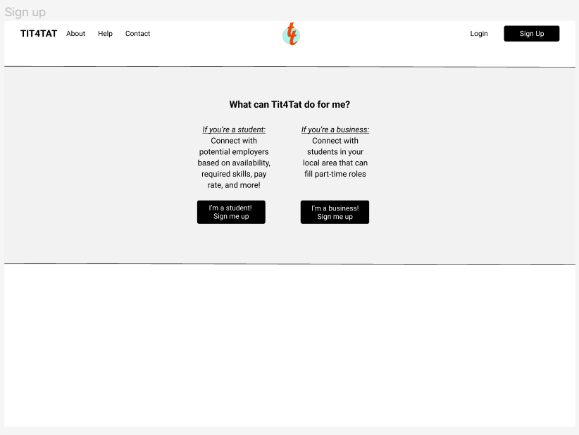
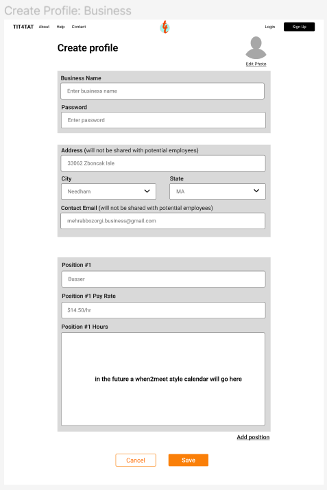
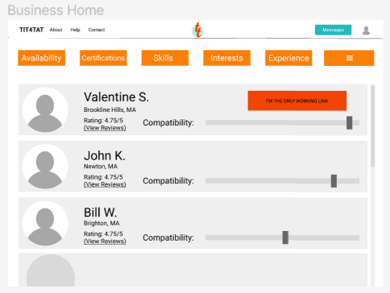
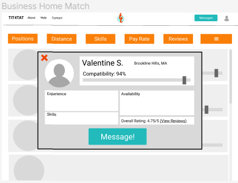
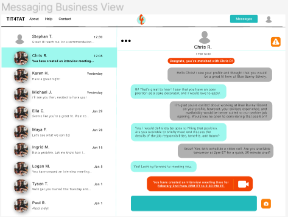
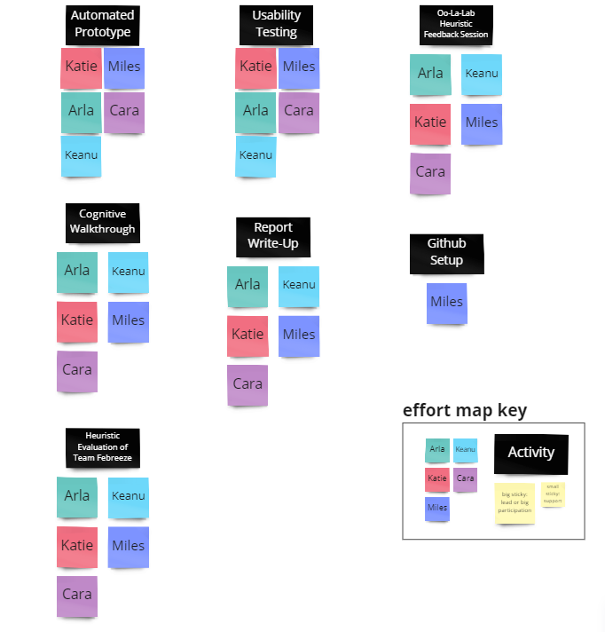
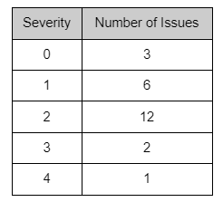
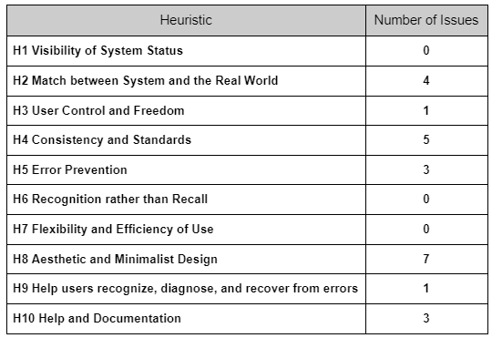
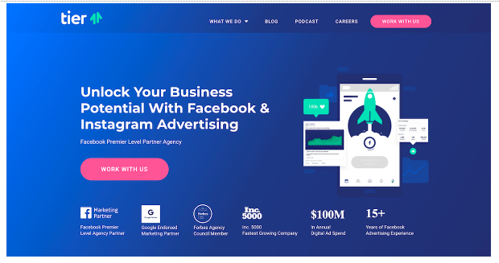
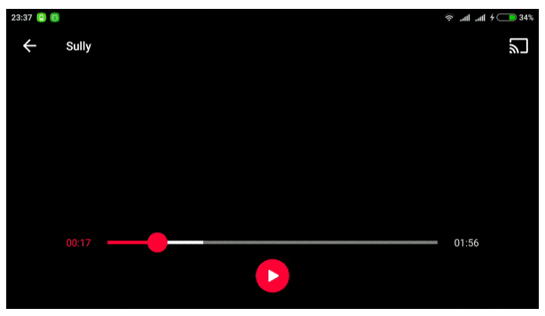

# Design Refinement Report
## Overview
Our design for the design refinement phase is a huge improvement over our paper prototype in the previous phase due to our time spent using Figma to digitize our artifacts. One of the major features that we will be sacrificing as a result of this phase in the name of fidelity is the scope of our design; before, we were intending to cover the interface for both students and employers. Now we have decided that we will be able to produce a higher fidelity prototype focusing on our original focus group, employers. Employers’ needs as evaluated in our design development will still be met by our interface, which will provide them a quick and intuitive way to contact prospective employees.
Our usability testing phase carried with it some quirks that various evaluative measures have revealed. Transferring from analog to digital allows us to streamline many features and remove the clunkiness of working with physical objects. We can use overlays, transformations, etc. to convey action; we can create shapes with greater precision than we can with physical objects; and we can shape the layout of the screen to more intuitively cater to the user’s experience. These modifications and others broadly comprise the majority of changes we plan on making to our prototype. In general, the digital prototype implementation was viewed to be a good draft and it felt less formal than LinkedIn while still achieving its purpose. This attains our goal of lowering the activation energy of creating job matches while also maintaining the semi-rigorous process of finding employees.
A cognitive walkthrough of our prototype revealed that we should’ve prioritized certain functionalities over others in this phase and could’ve streamlined our process more; for example, we did not flesh out filtering employee/employer recommendations in this phase when it is one of the main usability advantages of our application and we also did not consider the fatigue associated with the sign up process for our service. The walkthrough further revealed that feedback is an important aspect of an interface that we did little to address in our initial prototype, but that we will continue to improve upon. In our refined prototype, we will ensure that users have some receipt that their actions succeeded or were at least received by our system.
One of the main sources of constructive criticism in the refinement phase was the heuristic evaluation. We collected a series of peer-evaluated suggestions, many of which reflected a design that will need to mature aesthetically and functionally. One especially valid criticism made is that our website prototype appears to be made by many different people. Though it is, it shouldn’t appear that way, because that would reflect a disconnect between pages. We will develop a standard and remove our interface from its close attachment to our original paper prototype. Another highlight that came out of this evaluation was the emphasis on help and documentation. While it’s obvious to the creators of the interface how things work, it’s not immediately evident to those who have never used or thought of the application before. An intuitive interface is a given user need that we will address in future prototypes.

## Our Design and Its Functionality
Our platform is a website that matches employers with potential employees that are looking for less than part time work (i.e. college students looking to work 10 hours a week in their spare time). 
To start, users of our interface (potential employers and potential employees) arrive at our landing page where first time users can sign up for an account or returning users can log back in choosing their respective option. For our final design we will operate under the assumption that our users are business owners and as such the pages linked to Sign Up and Log In will be catered to assisting employers. The following walk through will also operate under this assumption, and look at this process through the lens of an employer.   

Employers create their profiles filling out information regarding what positions they are looking to hire for as well as what working hours they are looking to fill for these positions. 

Upon completing the business profile creation, employers will be brought to the Business Home Page where they can access their list of accumulated matches for potential employees. Potential employees will be shown based on how compatible they are with the respective business’ desired hiring hours. Employers then have the option to further filter compatible employees based on factors like skills, experience, etc. if these things are more desired than the candidate's availability.  

From this page employers can then click on any of the potential employees to open up a pop up window that contains more detailed information regarding the employee (i.e. their specific experience, availability, and skills). From this pop up window employers will be given the option to message the candidate within our interface. 

Clicking the message button will bring employers to their messaging page where they can communicate with potential employees. 

##Insights & Areas for Further Exploration
Through producing a Figma automated prototype, receiving feedback, and conducting a team introspective, we realized that we tried to stay too close to our paper prototype during our design process. Instead of searching for feedback and iterating our paper prototype before attempting to build our automated digital interface, we opted to simply transfer our paper prototype to Figma. This action did not provide us enough space to reflect on our design, think about the needs of our user groups, and build out appropriate features to produce a polished platform. We plan to iterate on our paper and automated prototypes, in addition to outsourcing feedback, in the next phase, before we attempt to design our next version of the automated prototype.
Reflecting on the feedback we received from the Heuristic Evaluation assignment, we believe that our system looks loosely strewn together and inconsistent. The team that evaluated our platform pointed out some issues with our platform’s aesthetic, such as our inconsistent color schemes and clustered text. We believe that these problems may be due to each member of the team working on a different part of the system and limited proofreading to ensure cohesion. In the future, we will work on developing each page as a team, which will hopefully lead to a more consistent platform.
Throughout this phase, our team worked for efficiency instead of cohesion of product. We evenly divided work amongst team members, which was a good way to manage our time and workload and resulted in getting assignments and classwork done in a very efficient manner. Consequently though, our product did not look standardized and cohesive. We learned that we need to have more team conversations on the goals of our interface and establish set templates for each of our pages.

We may have been over-ambitious in trying to produce interfaces for two user groups. In this way, we didn’t accurately satisfy the main needs and produce an intuitive platform for one of our user groups. Moving forward, we plan to downscope our project to address the needs for simply our business users, in hopes to produce a well-polished, easy-to-navigate interface for one user group.
Through reflecting on our Heuristic Evaluation feedback, we realized that we made several assumptions about our users, including that anyone viewing our interface would intuitively know the application’s purpose and navigation features. This assumption resulted in a lack of documentation throughout our platform. In the next phase, we plan to provide the user with an “About,” “Help,” and “Frequently Asked Questions” pages to help users understand how to complete their intended tasks.
We did not implement many security features throughout the interface, which may make users hesitant to engage with our application. We plan to employ privacy policy and terms and conditions documentation in our next iteration.
In the next phase, we plan to investigate and implement approaches to making our interface more aesthetically pleasing, intuitive, and consistent. This idea may include types of wireframe templates, buttons, color schemes, and fonts. We also want to focus on user security, so that our users feel safe interacting with our application.

## Effort Map
To see our team effort map for this phase, please consult

# Team Diesel: Tit4Tat  –  A Heuristic Evaluation
By Team Oo-La-Lab
Nabih, Oscar, Hardik, Sushmit, Dan Park
## Overall Evaluation
A good start on a good concept for a SaaS app! Most of these issues are most likely oversights not seen when first designing the app, so fleshing out the assumptions on the app and considering them on the app will do you all good. There are many great ideas that work well as features but we think that the next iteration should be framed around the template framework. This will allow the features to work in conjunction to allow for a more unified goal, intent, and emphasis. 
##Issues with Heuristic:

**[H2 Match between system and the real world] (Severity 2) – (2 person found)**
The compatibility bar currently looks like it can be toggled and moved around, confusing the user of its purpose. It would be better to use design conventions and fill the bar with green according to the compatibility score achieved.

**[H2 User Control & Freedom] (Severity 1) – (1 person found)** 
The messaging application currently lists all messages in one place. It could be worth adding an archive option that helps the user put past jobs in one folder to be able to follow up more easily with current opportunities.

**[H2 Match between system and the real world] (Severity 2) – (4 people found)**
The error message on the top right corner of the chat feature suggests that there is something the user should be paying attention to or altering. However, it is unclear what that is, leading the user to speculate whether there is an error or not. If the icon is supposed to indicate something else, it would be better to use a more appropriate icon (in place of an exclamation mark in a triangle).

**[H2 Match between system and the real world] (Severity 3) – (1 person found)**
The interface currently asks for the exact address of the user (Students) when filling in the form. This can be a privacy and security risk so one way of getting around it would be to just enter City and State like applications like LinkedIn and Handshake currently do.

**[H3 User Control and Freedom] (Severity 3) – (1 person found)**
Once the user enters their dashboard, there is no clear way to exit the platform. This could be fixed by making the logo or title icon into an exit button, leading to the landing page. Currently, if a user needs to exit the screen, they need to go through a set of actions before finally being able to click ‘Tit4Tat’ to exit to the dashboard. There are no options to exit to the landing page.

**[H4 Consistency & Standards] (Severity 1) – (2 people found)**
Starting Page starts immediately with a student vs business loading page, which is unusual for websites since most start with a landing page. Perhaps create an excellent landing page before entering the Student vs Business Signup/Login Page.

**[H4 Consistency & Standards] (Severity 1) – (3 people found)**
The interface for the sending and receiving messages had a different aesthetic compared to the rest of the frames. One suggestion would be to use the same types of boxes for the entire system (square or rounded corners)

**[H4 Consistency and Standards] (Severity 2) – (4 people found)**
Currently the ‘Create Profile’ and ‘Edit Profile’ pages are the same. This creates confusion in the difference between them and what is editable for a user or not. Creating separate pages for both, following convention, where the edit page has several tabs that allow users to toggle in and change the information would be much better.

**[H4 Consistency & Standards] (Severity 2) – (4 people found)**
It would be helpful to add an option for the employers to add the industry they are part off. It will help the students filter out jobs based on the type of work they are looking for.

**[H4 Consistency & Standards] (Severity 2) – (3 people found)**
For both the student and the business, it might be useful to have a username besides the name/business name since those are normally longer (specially in the business case) and having a username option can minimize the friction of logging in. Once again especially in the business case it can become easy to remember and have different users to log in and check the business status on the page.

**[H5 Error Prevention] (Severity 2) – (2 people found)**
Is there a specific way you’re looking at the input of skills for the student accounts? It seems to be very easy for people to write skills in very different ways and having to process all of those seems like hell, maybe a drop-down menu or just more generalised skills? In the same vein of thought, does it make sense for each job to have a “skills needed/expected” so that matching students to jobs is easier?

**[H5 Error Prevention] (Severity 2) – (2 people found)**
The interface where students get to create their profile has a text box for experience. Unlike skills, it has a large textbox along with options to ‘add experience’. It might be confusing for the user if they need to type everything in one place or add different boxes for past jobs.

**[H5 Error Prevention] (Severity 2) – (1 person found)**
In the ‘Create Profile’ page, there is only a one time input of the password. To prevent future complications, it may be better to have the user input password twice to ensure confirmation.

**[H8 Aesthetic and Minimalist Design] (Severity 0) – (1 person found)**
In the chat window, there is a reminder for a meeting call. The video camera icon on the right seems ambiguous without more interaction. Is it just a visual placeholder that reminds you they would like to video call or is there more meaning ?

**[H8 Aesthetic and Minimalist Design] (Severity 0) – (1 person found)**
The search page has tiny check markers to identify metrics that fit the user. They can be a bit tough to see, and also would be nice to be seen in the larger view when you click on the profile to remind the user why this employer or employee is a good choice.
Tangent to that is only the top 2 metrics being identified on the search page. I ask this since Blue Bunny has a distance match, but Max’s Pie shop does not, but is listed as only a half mile away when you click on it, which seems like a very reasonable distance to travel via most modes of transit.

**[H8 Aesthetic and Minimalist Design] (Severity 0) – (1 person found)**
When looking at an employer’s profile via the search page, the wording experience, skills, and availability, sound like the characteristics for the student profile. Slight changes here could be useful to clarify, however also adding context in these fields might be enough to clarify the difference for one type of user versus the other.

**[H8 Aesthetic and Minimalist Design] (Severity 1) – (1 person found)**
The starting page offers action buttons that communicate but apart from that the user faces a screen which doesn’t provide much information about the platform they are using. It also leaves the user feeling that the platform isn’t well polished and has a lack of general aesthetic.

**[H8 Aesthetic and Minimalist Design] (Severity 1) – (2 people found)**
Throughout the platform the color schemes can clash at times with the bright red and orange against teal. As well as the orange buttons for filters in particular feel blocky and undefined in their usage.

**[H8 Aesthetic and Minimalist Design] (Severity 2) – (1 person found)**
The filters in the match search page at the top, the bright orange buttons, are a bit blocky looking and I am unsure what filtering with those would look like. Also, as a small sidenote, when looking at “Valentine S.”’s profile, the orange filter buttons on top do not match with the business page’s filters.

**[H8 Aesthetic and Minimalist Design] (Severity 2) – (2 people found)**
The sign-up page has clustered text that makes it feel like a lot is going on when the only thing the user is searching for is a sign up button. The two buttons could be condensed to one button and make a field elsewhere that differentiates.

**[H9 Help users recognize, diagnose, and recover from errors] (Severity 2) - (1 person found)**
It will be helpful to allow employers to input wages not below the minimum wage based on their states.

**[H10 Help and Documentation] (Severity 2) - (2 people found)**
For a ‘when2meet’, it may be useful to provide a small blurb about how to fill the form, what availability to insert, and things to consider for users’ availability

**[H10 Help and Documentation] (Severity 1) - (1 person found)**
The Help section is not available, but I also understand if that was not a goal for the current flow presentation. It however is something that would be nice to see and have available even if its brief and non-interactive.

**[H10 Help and Documentation] (Severity 4) - (2 people found)**
What will be the approach to rating individual workers and how would you enforce it? Would be wary of this app as reviews may harm if viewable by places. This is an excellent article I read https://www.jstor.org/stable/26634939?seq=4#metadata_info_tab_contents recently that talks about the emotional side of reviews and may be a side of contention that needs to be in heavy consideration before going ahead with a personal review system by companies. Could look towards endorsements on LinkedIn for inspiration.
##Summary Tables:

## Suggestions:
* The compatibility bar could be re-done to not appear as a slider to the user.
* Change the icon in the chat menu (top right, looks like a warning) so that the user is not confused as to what it means.
* Re-evaluate icons/buttons on all pages to make sure the intended usage and signifiers are being displayed to the user.
* To go along with re-thinking your icons and buttons, make sure to evaluate your color schemes throughout to be non-distracting and appealing to the user. 
* Give some more time to your landing page, if you choose it to be a sign-up page, we found that the current setup, while usable, could have improvements based on our previous feedback.
* When it comes to the website overall, there is currently no way to log-out/get back to the landing page. While notsystem-breaking, it would be a nice feature to enhance the overall interaction of y’alls product.
* We found there to be some discrepancy of how the filters would work in the search page. Some more thought about how to represent those and what they mean to the user, in regards to how the search is evaluating the best choices, could be helpful.
* Differentiate the sign-up pages for business and students. To go along with this, some of our comments about taking exact addresses, adding Industry or other notable factors, and privacy could be considered as options to also implement. We also found that some of the content seems to match throughout the website for both accounts. This could be an oversight or intended, but it is something to note seeing as it created a bit of confusion when navigating both accounts.
* To go along with this, also adding a Privacy Policy/Terms and Conditions could be a nice addition. We found a website to generate this for us. If you want to reach out we’d be glad to find it, if not there seems to be many that can do this for you.
* Another thought similar to this would be adding a help page/FAQ to increase the overall strength of your product.
* Minor thing would be adding a confirm password field in the sign up as well.
* **Overall for more clarification on any of these suggestions, feel free to reach out and/or check the Heuristic Violations that we found above, seeing as these suggestions come from there.**

## Appendix: 
### Hardik Pandey

[H8 Aesthetic and Minimalist Design] (Severity 1)
The starting page offers action buttons that communicate but apart from that the user faces a screen which doesn’t provide much information about the platform they are using. It also leaves the user feeling that the platform isn’t well polished and has a lack of general aesthetic.

[H3 User Control and Freedom] (Severity 3)
Once the user enters their dashboard, there is no clear way to exit the platform. This could be fixed by making the logo or title icon into an exit button, leading to the landing page. Currently, if a user needs to exit the screen, they need to go through a set of actions before finally being able to click ‘Tit4Tat’ to exit to the dashboard. There are no options to exit to the landing page.

[H2 Match between system and the real world] (Severity 1)
The compatibility bar currently looks like it can be toggled and moved around, confusing the user of its purpose. It would be better to use design conventions and fill the bar with green according to the compatibility score achieved.

[H2 Match between system and the real world] (Severity 1)
The error message on the top right corner of the chat feature suggests that there is something the user should be paying attention to or altering. However, it is unclear what that is, leading the user to speculate whether there is an error or not. If the icon is supposed to indicate something else, it would be better to use a more appropriate icon (in place of an exclamation mark in a triangle).

[H4 Consistency and Standards] (Severity 1)
Currently the chat menu has the error icon and and camera icon in orange color. Even though they are the same color, they perform wildly different functions, leading to a lack of consistency in communication from the system. Either the error message should be colored in red or the camera icon should be grayed out. 

[H4 Consistency and Standards] (Severity 2)
Currently the ‘Create Profile’ and ‘Edit Profile’ pages are the same. This creates confusion in the difference between them and what is editable for a user or not. Creating separate pages for both, following convention, where the edit page has several tabs that allow users to toggle in and change the information would be much better.

[H4 Consistency and Standards] (Severity 2)
In the ‘Create Profile’ page the confirmation button currently says ‘Save’. Following convention and using a ‘Sign Up’ button would be a better way to communicate the action taking place.

[H4 Consistency and Standards] (Severity 2)
In the chat menu, we see interview times being decided but it seems unclear how these times were reached and what tool was used to do so. If it is through the ‘when2meet’, it may be better to have a ‘meeting’ tab in the chat that allows for users to select times. Currently, it seems these times were set up outside the platform and then inserted in chat.

[H4 Consistency and Standards] (Severity 2)
In the pop up menu showing business matches for students, currently there is no tab showing ‘Pay Rate’ and ‘Positions’ even though they have been selected as filters. This is vital information that the student would expect to receive. If this information hasn’t been provided by the business, it’d be better to state that in the pop up menu to maintain consistency throughout the system. 

[H8 Aesthetic and Minimalist Design] (Severity 1)
Throughout the platform there are several clashing colors being used. The use of red and orange, alongside a teal makes the visual experience conflicting. Leading to the user being distracted by the visuals.

[H5 Error Prevention] (Severity 2)
In the ‘Create Profile’ page, there is only a one time input of the password. To prevent future complications, it may be better to have the user input password twice to ensure confirmation.

[H7 Flexibility and Efficiency of Use] (Severity 2)
In the ‘Edit Profile’ page, there is no navigation bar that allows users to directly access a different page. This limits the user's capabilities and forces the user to exit the page and then access the desired page.

[H10 Help and Documentation] (Severity 2)
For a ‘when2meet’, it may be useful to provide a small blurb about how to fill the form, what availability to insert, and things to consider for users’ availability.

### Sushmit
[H4 Consistency & Standards] (Severity 1)
The interface for sending and receiving messages had a different aesthetic compared to the rest of the frames. One suggestion would be to use the same types of boxes for the entire system (square or rounded corners) 

[H2 Match between system and the real world] (Severity 3)
The interface currently asks for the exact address of the user (Students) when filling in the form. This can be a privacy and security risk so one way of getting around it would be to just enter City and State like applications like LinkedIn and Handshake currently do. 

[H2 User Control & Freedom] (Severity 2)
The messaging application currently lists all messages in one place. It could be worth adding an archive option that helps the user put past jobs in one folder to be able to follow up more easily with current opportunities.
 
[H4 Consistency & Standards] (Severity 3)
The page that employers see has a feature where they can see the ‘rating’ of the people they are employing. These ‘rating’ might rescript opportunites for people in the future, and can be taken negatively. LinkedIn goes about the process through the use of “Endorsements” where the user (students) have the ability to share that with future employers. 
 
[H5 Error Prevention] (Severity 2)
The interface where students get to create their profile has a text box for experience. Unlike skills, it has a large textbox along with options to ‘add experience’. It might be confusing for the user if they need to type everything in one place or add different boxes for past obs. 
 
[H4 Consistency & Standards] (Severity 2)
It might be interesting to add a feature that allows the students to see their own profile from the eyes of the employers like LinkedIn or Canvas does. 
 
[H4 Consistency & Standards] (Severity 2)
The interface for the job posting page had space for the name, rate, and hours. It would be helpful to add a box for the job description and what type of skills they are looking for. 
 
[H4 Recognition rather than recall] (Severity 2)
Based on the fact that this job board so tailored towards smaller businesses, it could be helpful to add a link next to the “Position #1 Pay Rate” option with links to average salary rates for specific jobs.
 
[H9 Help users recognize, diagnose, and recover from errors] (Severity 2)
Along the same lines as pay rate recommendations, it might be helpful to now allows employers to input wages below the minimum wage based on their states.
 
[H4 Consistency & Standards] (Severity 2) 
It would be helpful to add an option for the employers to add the industry they are part off. It will help the students filter out jobs based on the type of work they are looking for. 
 
[H8 Aesthetic and minimalist design] (Severity 2) 
The log-in page has two options “student” and “business”. In terms of cutting down on the number of buttons, and decisions users need to make, those two buttons could be combined into one. 
 
[H4 Consistency & Standards] (Severity 2) 
For the user group of students, the option for putting in an email is after the address block. Many websites put their contact information together such as name, password, and email. 

### Daniel Park

[H4 Consistency & Standards] (Severity 1)
Starting Page starts immediately with a student vs business loading page, which is unusual for websites since most start with a landing page. Perhaps create an excellent landing page before entering the Student vs Business Signup/Login Page.

[H4 Consistency & Standards] (Severity 2)
A username input may be necessary instead of having a full name which will always have spacing issues.

[H4 Consistency & Standards] (Severity 2)
What is the purpose of having an address if it is not being saved? Will a City/State not suffice? On the reverse side, why will the employee not be able to view the address? Would make the most sense for employees to recognise if this is a feasible workplace to travel to and from.

[H7 Flexibility and Efficiency of Use] (Severity 3)
How will experience and skills be inputted? Suggestion on using https://simplify.jobs/ as inspiration on this matter.

[H10 Help and Documentation] (Severity 2)
Although when2meet is familiar with us, there should be a help option to walk through on filling it out. Also, a problem with using when2meet is that it’s impossible to use on a tiny phone where dragging is wildly inaccurate.

[H4 Consistency & Standards] (Severity 1)
The Compatibility Bar reminds me of a video drag bar similar to the image below. A fix to how it looks/making it numerical compatibility instead?

[H8 Aesthetic & Minimalist Design] (Severity 2)
The orange top bar buttons could be reduced or more clearly defined on how they are sorted.

[H4 Consistency & Standards] (Severity 4)
Will matches be based on position or establishment? The modules suggest that it is by the establishment, but the chats suggest that the user is applying by role.

[H2 Match between system and the real world] (Severity 1)
What is the caution orange button in the top right corner of the chat menu? Does it mean notification? An icon like that suggests something more sinister.

[H3 User Control and Freedom] (Severity 2)
No general support for undo and redo functionalities between screens.

[H10 Help and Documentation) (Severity 3)
What will be the approach to rating individual workers? Would be wary of this app as reviews may harm if viewable by places. This is an excellent article I read https://www.jstor.org/stable/26634939?seq=4#metadata_info_tab_contents  recently that talks about the emotional side of reviews and may be a side of contention that needs to be in heavy consideration before going ahead with a personal review system by companies.

[H4 Consistency and Standards] (Severity 1)
What is the search by certifications for? Will some gig work require certifications?

### Oscar

[H4 Consistency & Standards] (Severity 1)
When Looking at the match page, each user’s profile has a compatibility percentage. This percentage is also represented by a long bar with a rectangle to represent this percentage. This however looks exactly like what the user might expect to be a slider. I know I kept clicking it trying to drag it over and over, even though I know that it wasn’t supposed to be that.

[H4 Consistency & Standards] (Severity 1)
In the messages for a student versus the business side, the business side is missing any chats visible on the left side, or even the one open chat that is the example. Also the name on the chat for the business side shows a link to a message from “Valentine S.”, but the chat shows “Chris R.” as the recipient of the messages.

[H4 Consistency & Standards] (Severity 2)
The “TIT4TAT” logo in the middle of the page seems like it should also be clickable, just like the left side of the header where the name is spelt out. I feel it standard for most websites that the logo is also a link to the homepage and something I personally tried clicking a couple times assuming I could go back to the homepage via this.

[H10 Help and Documentation] (Severity 3)
The Help section is not available, but I also understand if that was not a goal for the current flow presentation. It however is something that would be nice to see and have available even if its brief and non-interactive.

[H8 Aesthetic and Minimalist Design] (Severity 2)
The filters in the match search page at the top, the bright orange buttons, are a bit blocky looking and I am unsure what filtering with those would look like. Also, as a small sidenote, when looking at “Valentine S.”’s profile, the orange filter buttons on top do not match with the business page’s filters.

[H8 Aesthetic and Minimalist Design] (Severity 3)
I am a little confused what the orange hazard symbol means on the chat page. Is this a notification, a link to their profile, etc?

[H8 Aesthetic and Minimalist Design](Severity 0)
In the chat window, there is a reminder for a meeting call. The video camera icon on the right seems ambiguous without more interaction. Is it just a visual placeholder that reminds you they would like to video call or is there more meaning?

[H4 Consistency & Standards] (Severity 0)
To build upon the last statment, is the video camera icon supposed to be a link to a meeting call? I feel I have seen other applications use an icon of sorts as a way to link to a call, if so maybe adding a tiny line underneath or interaction field to show this would be helpful.

[H4 Consistency & Standards] (Severity 0)
In the profile page for business, the disclaimer for address “will not be shared with potential employers” seems to be not needed, seeing as you would be the employer.

[H8 Aesthetic and Minimalist Design] (Severity 1)
The text on the landing page for student vs business feels cramped both vertically and horizontally seeing as how much open space the page provides.

[H8 Aesthetic and Minimalist Design] (Severity 0)
When looking at an employer’s profile via the search page, the wording experience, skills, and availability, sound like the characteristics for the student profile. Slight changes here could be useful to clarify, however also adding context in these fields might be enough to clarify the difference for one type of user versus the other.

[H8 Aesthetic and Minimalist Design] (Severity 0)
The search page has tiny check markers to identify metrics that fit the user. They can be a bit tough to see, and also would be nice to be seen in the larger view when you click on the profile to remind the user why this employer or employee is a good choice. Tangent to that is only the top 2 metrics being identified on the search page. I ask this since Blue Bunny has a distance match, but Max’s Pie shop does not, but is listed as only a half mile away when you click on it, which seems like a very reasonable distance to travel via most modes of transit.

### Nabih

[H4 Consistency and Standards] (Severity 1)
It feels slightly jarring to start on the sign-up page. I would really appreciate a landing page that tells you a little more what the project is about and then lets you choose your sign-in option.

[H4 Consistency and Standards] (Severity 2)
For both the student and the business, it might be useful to have a username besides the name/business name since those are normally longer (specially in the business case) and having a username option can minimise the friction of logging in. Once again especially in the business case it can become easy to remember and have different users to log in and check the business status on the page.

[H5 Error Prevention] (Severity 2) 
Is there a specific way you’re looking at the input of skills for the student accounts? It seems to be very easy for people to write skills in very different ways and having to process all of those seems like hell, maybe a drop-down menu or just more generalised skills? In the same vein of thought, does it make sense for each job to have a “skills needed/expected” so that matching students to jobs is easier?

[H2 Match between System and real world] (Severity 1)
In the chat menu, there is a warning button on the top right next to the user that you’re messaging with. What is this button for? My first thought was that it was to report the user but if its that it should be more clearly demarcated for that. If the user is another one the icon does not seem to match it and could be better chosen.

[H4 Consistency and Standards] (Severity 1)
I am assuming the orange buttons are to search for jobs based on that specific attribute (skills, availability, etc.), in that case, if you can search by certification, where are these certifications added to the jobs and students? And in that same vein, where are all of these categories added to the jobs? The sign-up page for businesses should have more data for each job.

[H4 Consistency and Standards] (Severity 1)
On the same note as above, business accounts should have two separate tabs, one for the account settings and one for the jobs settings. That way, the settings of the account itself can be accessed through one part, and posting and removing jobs can be done through another one.

I don’t know which sections - Severity 3
It is pretty clear to me how jobs are ranked for each student, but, how is each student ranked against each job? The skills seemed to be a binary input of “do you have the skill or not” and not a slider of proficiency at the skill so the ranking is interesting to me.

