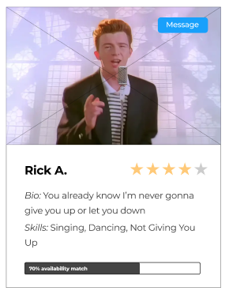
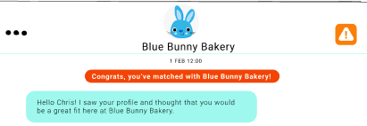
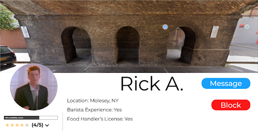
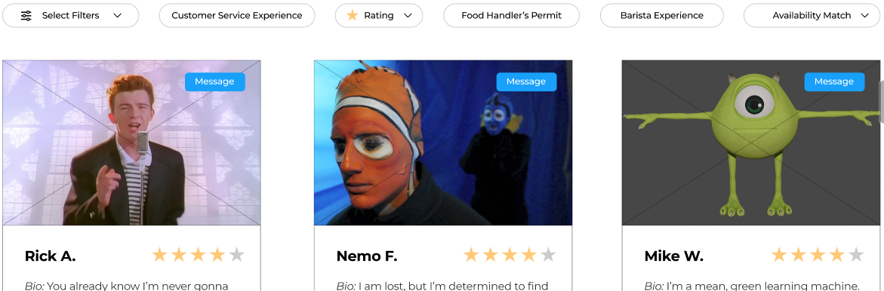
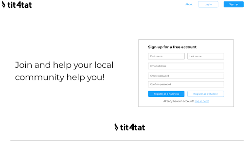
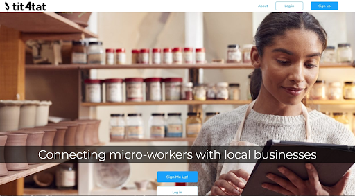

# Final Refinement
We addressed a series of Nielsen heuristic evaluations that were of lower severity but were easy to take action against. Among these was changing a lot of aesthetics and iconography to convey meaning more clearly. The most severe ones–feeling that we needed to add more context and documentation, maintaining a constant aesthetic, and having understandable icons–we all addressed. We changed the compatibility bar on the search page so that it would be less confusing; 

 

the color scheme so that it was more consistent throughout; 

  

 

the block button so that the action was clear; 

and many other buttons to make their meaning obvious overall. We modified the order of the pages to match the logical flow of our site and balanced the amount of content we listed per page. For example, we refined our landing page and separated the create and sign up pages into two separate forms. 

We did something similar with creating job listings versus editing existing ones to enforce their difference. We also addressed boundary problems like employers inputting sub-minimum wage hourly rates into our system by creating a dropdown of available options instead. We imagine this dropdown would change depending on location to reflect minimum wage. We similarly addressed the case of a user inputting their password wrong upon account creation by adding a “confirm password” field. The final piece of feedback that we addressed was adding more documentation in our “about” page, which has become the landing page for users who are not signed in. 

 

With all of these heuristic evaluation adjustments in place, our final automated prototype would work for another round of usability feedback from real users. It is almost fully functional, as it has a cohesive design and working navigation.

